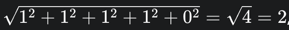

# 유사도 측정

# Usage

데이터 샘플
```
val data: List<String> = listOf(
    "보험 계약정보", 
    "보험계약 조회", 
    "나의 자동이체정보", 
    "미래연금예상액 조회",
    "사고보험금 신청"
)
```

## 문자열 포함 유사도
Usage 1)
```kotlin
println("=== 문자열 포함 여부 유사도 (최소 $minSimilarity) 출력 ===")
val matcher = StringSimilarityMatcher()
val results = matcher.findSimilarStrings(
    data,
    target,
    minSimilarity,
    StringSimilarityMatcher.SimilarityMethod.CONTAINMENT
)
results.forEach { result ->
    println("${result.text}: ${String.format("%.3f", result.similarity)}")
}
```

Usage 2)
```kotlin
val matcher = StringSimilarityMatcher() 
val similarity = matcher.findByContainment(data, "계약")
println("문자열 포함 여부: $similarity")
```

## 위치 기반 유사도

Usage 1)
```kotlin
println("=== 문자열 위치 기반 ===")
val matcher = StringSimilarityMatcher()
val substringResults = matcher.findMatchingStrings(
    data = data,
    target = target,
    maxDifferences = 1,
    includeSubstring = true,
    method = StringSimilarityMatcher.DifferenceMethod.POSITION_BASED
)
substringResults.forEach { result ->
    println("${result.originalString} -> ${result.matchedPart} (차이: ${result.differences}개)")
}
```

Usage 2)
```kotlin
val matcher = StringSimilarityMatcher() 
val positionResults = matcher.findByPositionDifferences(data, "계약", 5)
println("위치 기반 결과:")
positionResults.forEach { (text, diff) ->
    println("  $text: $diff 개 차이")
}
```

## 문자열 빈도 유사도

검색문자와 대상문자를 비교하여 (검색문자 포함일 경우) 몇개의 문자가 차이 나는지 비교

Usage 1)
```kotlin
println("=== (빈도 기반) 다른 알파벳 개수 기준 (최대 5개) ===")
val matcher = StringSimilarityMatcher()
val results = matcher.findMatchingStrings(
    data = data,
    target = target,
    maxDifferences = 5,
    includeSubstring = false,
    method = StringSimilarityMatcher.DifferenceMethod.FREQUENCY_BASED
)
results.forEach { (text, diffCount) ->
    println("$text: 다른 문자 $diffCount 개")
}
```

Usage 2)
```kotlin
println("=== (빈도 기반) 다른 알파벳 개수 기준 (최대 1개) ===")
val matcher = StringSimilarityMatcher()
val results = matcher.findByDifferentCharCount(data, target, 1)
results.forEach { (text, diffCount) ->
    println("$text: 다른 문자 $diffCount 개")
}
```


## 유사도 알고리즘

Usage 1)
```kotlin
val matcher = StringSimilarityMatcher()
val levenshteinResults = matcher.findSimilarStrings(
    data,
    target,
    minSimilarity,
    StringSimilarityMatcher.SimilarityMethod.LEVENSHTEIN // 알고리즘 변경 가능
)
levenshteinResults.forEach { result ->
    println("${result.text}: ${String.format("%.3f", result.similarity)}")
}
```

---
# 알고리즘 설명

## 레벤슈타인 거리(Levenshtein Distance)

- 측정 대상: 두 문자열
- 측정 방식: 한 문자열을 다른 문자열로 변환하는 데 필요한 최소한의 편집(삽입, 삭제, 교체) 횟수를 거리로 측정합니다.
- 핵심: 철자나 순서의 차이에 민감하게 반응합니다.
- 결과: 거리가 작을수록(낮을수록) 더 유사합니다. (예: 0이면 두 문자열은 동일)
- 주요 용도: 오타 수정, 철자 교정, DNA 서열 분석 등.
- 사용 용도: 문자열 간의 오타나 철자 오류를 교정할 때 유용합니다. 두 단어가 얼마나 다른지 '편집 거리'로 측정하기 때문에, 검색어 자동 완성, 맞춤법 검사기, 유사한 단어 추천 등에 주로 사용됩니다.


## 자카드 유사도(Jaccard Similarity)

- 측정 대상: 두 데이터 집합 (예: 문자열을 단어 집합으로 분리)
- 측정 방식: 두 집합의 교집합 크기를 합집합 크기로 나누어 유사도를 측정합니다.
- 핵심: 두 집합이 공유하는 요소의 비율을 계산합니다.
- 결과: 0과 1 사이의 값으로, 1에 가까울수록 더 유사합니다. (예: 1이면 두 집합은 동일)
- 주요 용도: 문서 간 유사성 측정, 태그나 재료 목록 비교, 웹 페이지 유사도 분석 등.
- 사용 용도: 두 집합 간의 유사성을 측정할 때 사용합니다. 예를 들어, 두 문서가 얼마나 많은 단어를 공유하는지, 또는 두 고객이 구매한 상품 목록이 얼마나 유사한지 등을 파악하여 추천 시스템이나 문서 중복 제거에 활용됩니다.


## 코사인 유사도(Cosine Similarity)

- 측정 대상: 두 벡터
- 측정 방식: 두 벡터 사이의 **각도(cosine)**를 측정하여 유사도를 계산합니다. 벡터의 크기(길이)는 고려하지 않고, 방향의 유사성만 측정합니다.
- 핵심: 텍스트를 벡터로 변환(TF-IDF 등)하여, 단어의 출현 빈도 및 중요도를 바탕으로 문서 간 유사도를 측정할 때 주로 사용됩니다.
- 결과: -1과 1 사이의 값으로, 1에 가까울수록 더 유사합니다. (예: 1이면 두 벡터는 동일한 방향)
- 주요 용도: 문서 검색, 추천 시스템, 텍스트 분류 등.
- 사용 용도: 텍스트를 벡터로 표현했을 때, 두 벡터가 가리키는 방향의 유사성을 측정합니다. 문서의 길이가 달라도 단어의 중요도(빈도)를 고려하여 유사도를 판단하므로, 문서 검색, 텍스트 분류, 추천 시스템 등에서 폭넓게 사용됩니다.


## 자로 유사도(Jaro Similarity)
[주의] Jaro 는 Jaro-Winkler 와 다른 결과가 나온다.

- 측정 대상: 두 문자열
- 측정 방식: 두 문자열에 공통으로 포함된 문자의 수와, 공통 문자가 서로 다른 위치에 있는 경우의 전위(transposition) 횟수를 고려하여 유사도를 점수로 계산합니다.
- 핵심: 문자열의 순서가 조금 바뀌더라도 높은 유사도 점수를 부여합니다.
- 결과: 0과 1 사이의 값으로, 1에 가까울수록 더 유사합니다.
- 주요 용도: 이름, 주소 등 데이터베이스의 불일치 데이터 정제, 레코드 매칭 등.
- 사용 용도: 특히 이름이나 주소 등 짧은 문자열의 유사도를 측정할 때 효과적입니다. 문자의 순서가 조금 바뀌더라도 높은 점수를 부여하는 특징이 있어, 데이터베이스에서 중복된 이름을 찾거나, 오타가 포함된 이름을 검색하는 등의 데이터 정제 작업에 적합합니다.


## 요약 비교표
| 알고리즘	| 측정 대상	| 측정 방식		| 주요 특징				| 결과			 |
|----------|-----------|---------------|----------------------|-----------------|
| 레벤슈타인	| 문자열		| 편집 횟수		| 철자나 순서 차이에 민감		| 거리가 낮을수록 유사 |
| 자카드	| 집합		| 교집합/합집합	| 공유하는 요소의 비율		| 1에 가까울수록 유사 |
| 코사인	| 벡터		| 벡터 간 각도		| 단어 빈도 기반 방향 유사성	| 1에 가까울수록 유사 |
| 자로		| 문자열		| 공통 문자와 전위	| 순서가 바뀐 경우에도 유사	| 1에 가까울수록 유사 |


## 예시

문자
```
원본: "김치찌개"
검색어: "김치찌게" (오타)
```

- 레벤슈타인 거리 (Levenshtein Distance)
  - 설명: '김치찌개'를 '김치찌게'로 바꾸는 데 필요한 편집 횟수를 계산합니다.
  - 작동 방식: 
    - '김치찌개'를 '김치찌게'로 바꾸기 위해 '개'를 '게'로 교체하는 작업이 한 번 필요합니다.
  - 결과: 거리 1. (거리가 낮을수록 유사하므로, 매우 유사하다고 판단)

- 자카드 유사도 (Jaccard Similarity)
  - 설명: 두 문자열의 단어 집합이 얼마나 겹치는지 비율을 계산합니다. 여기서는 한 글자씩 잘라서 집합을 만듭니다.
  - 작동 방식:
    - 원본 집합: {'김', '치', '찌', '개'}
    - 검색어 집합: {'김', '치', '찌', '게'}
    - 교집합: {'김', '치', '찌'} (크기: 3)
    - 합집합: {'김', '치', '찌', '개', '게'} (크기: 5)
    - 유사도: 교집합 크기 / 합집합 크기 = 3 / 5 = 0.6
  - 결과: 0.6. (0과 1 사이의 값으로, 중간 정도의 유사성)

- 코사인 유사도 (Cosine Similarity)
  - 설명: 각 단어의 출현 빈도를 벡터로 만들어 유사도를 측정합니다. 
  - 작동 방식:
    - 단어 목록: '김', '치', '찌', '개', '게'
    - 원본 벡터: [1, 1, 1, 1, 0] ('개'는 있고 '게'는 없음)
    - 검색어 벡터: [1, 1, 1, 0, 1] ('개'는 없고 '게'는 있음)
    - 벡터 내적: (11) + (11) + (11) + (10) + (0*1) = 3
    - 벡터 크기: 
      - 원본은 , 
      - 검색어는 
    - 유사도: 내적 / (원본 크기 * 검색어 크기) = 3 / (2 * 2) = 0.75 
  - 결과: 0.75. (1에 가까우므로, 상당히 유사하다고 판단)

- 자로 유사도 (Jaro Similarity)
  - 설명: 공통 문자와 순서 뒤바뀜(전위)을 고려하여 유사도를 계산합니다.
  - 작동 방식:
    - '김치찌개'와 '김치찌게'는 '김', '치', '찌'까지 공통 문자로 일치합니다.
    - '개'와 '게'는 한 글자가 다르지만, 자로 유사도는 대부분의 문자가 일치하므로 높은 점수를 부여합니다.
  - 결과: 0.972에 가까운 매우 높은 점수가 나옵니다. (1에 가까우므로, 매우 유사하다고 판단)

- 결론
  - 레벤슈타인 거리는 단 한 글자의 오타도 거리 1로 명확하게 잡아냅니다.
  - 자카드 유사도는 단어 집합의 겹침을 기준으로 0.6이라는 중간 점수를 부여합니다.
  - 코사인 유사도는 단어의 유무와 빈도를 고려해 0.75라는 높은 유사도를 산출합니다.
  - 자로 유사도는 철자 하나가 다른 경우에도 문자열의 전반적인 유사성을 높게 평가하여 0.972라는 매우 높은 점수를 산출합니다.

이처럼 검색의 목적과 데이터의 특성(오타 보정, 의미적 유사성 등)에 따라 적합한 알고리즘을 선택하는 것이 중요합니다.
